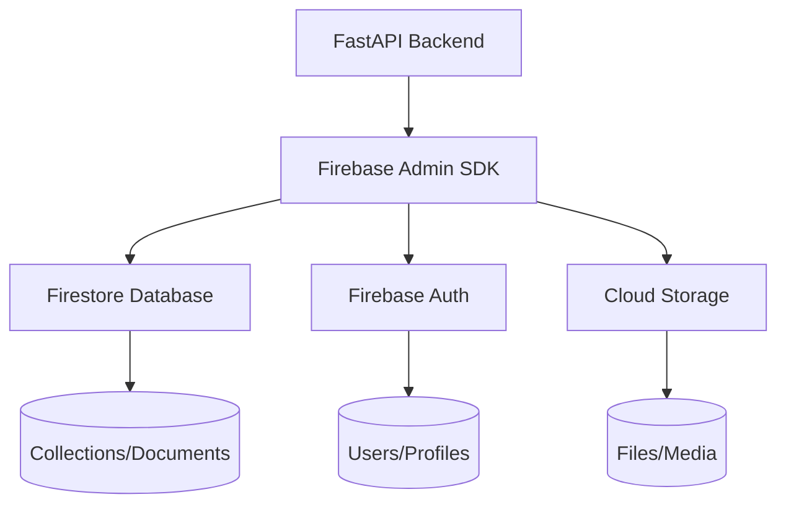

# Database Architecture Documentation

## Overview

The ZODIRA astrology application uses **Firebase Firestore** as its primary database system. Firestore is a NoSQL document database that provides real-time data synchronization, offline support, and robust security features. This architecture supports the application's multi-tenant nature with user-specific data isolation and scalable astrology calculations.

## Architecture Principles

### 1. **NoSQL Document Database**
- **Schema Flexibility**: Accommodates varying astrology data structures
- **Hierarchical Data**: Natural fit for user-centric data organization
- **JSON-based**: Direct mapping to application data models

### 2. **Serverless Architecture**
- **Auto-scaling**: Handles variable traffic patterns
- **Pay-per-use**: Cost-effective for astrology calculations
- **Managed Service**: Reduced operational overhead

### 3. **Real-time Capabilities**
- **Live Updates**: Real-time prediction and consultation updates
- **Offline Support**: Client-side data persistence
- **Automatic Sync**: Cross-device data consistency

## Core Database Components

### Firebase Services Used

1. **Firestore Database** - Primary data storage
2. **Firebase Authentication** - User management
3. **Cloud Storage** - File and media storage
4. **Firebase Security Rules** - Access control

### Technology Stack



## Data Model Architecture

### Collection Structure

The database follows a hierarchical collection structure optimized for user data isolation and efficient querying.

#### 1. **Users Collection** (`/users/{userId}`)
Primary user account information and preferences.

```json
{
  "userId": "firebase_auth_uid",
  "email": "user@example.com",
  "phone": "+91-9876543210",
  "displayName": "John Doe",
  "subscriptionType": "free",
  "language": "en",
  "timezone": "Asia/Kolkata",
  "preferences": {
    "notifications": true,
    "theme": "light"
  },
  "profileComplete": true,
  "primaryProfileId": "profile_doc_id",
  "createdAt": "2024-01-01T00:00:00Z",
  "lastLoginAt": "2024-01-01T00:00:00Z",
  "isActive": true
}
```

**Indexes**: `userId`, `email`, `phone`, `createdAt`

#### 2. **Profiles Subcollection** (`/users/{userId}/profiles/{profileId}`)
Individual astrology profiles for users and family members.

```json
{
  "profileId": "auto-generated",
  "userId": "firebase_auth_uid",
  "name": "Arjun Patel",
  "birthDate": "1993-08-22",
  "birthTime": "19:15:00",
  "birthPlace": "Ahmedabad, Gujarat, India",
  "latitude": 23.022505,
  "longitude": 72.571365,
  "gender": "male",
  "relationship": "self",
  "zodiacSign": "Leo",
  "moonSign": "Cancer",
  "nakshatra": "Magha",
  "ascendant": "Virgo",
  "createdAt": "2024-01-01T00:00:00Z",
  "updatedAt": "2024-01-01T00:00:00Z",
  "isActive": true
}
```

**Indexes**: `userId`, `profileId`, `birthDate`, `zodiacSign`

#### 3. **Marriage Matches** (`/marriage-matches/{matchId}`)
Compatibility analysis results between profiles.

```json
{
  "matchId": "auto-generated",
  "maleProfileId": "profile_doc_id",
  "femaleProfileId": "profile_doc_id",
  "userId": "firebase_auth_uid",
  "totalGunas": 28,
  "compatibilityScore": 85.5,
  "overallMatch": "Excellent Match",
  "gunaBreakdown": {
    "varna": 1,
    "vasya": 2,
    "tara": 3,
    "yoni": 4,
    "grahMaitri": 5,
    "gan": 2,
    "bhakoot": 7,
    "nadi": 4
  },
  "doshaAnalysis": {
    "mangalDosha": "none",
    "kaalSarpDosha": "none",
    "pitraDosha": "none"
  },
  "recommendations": [
    "This is an excellent match",
    "Consider marriage timing based on planetary positions"
  ],
  "createdAt": "2024-01-01T00:00:00Z",
  "expiresAt": "2024-01-31T00:00:00Z"
}
```

**Indexes**: `userId`, `maleProfileId`, `femaleProfileId`, `createdAt`

#### 4. **Predictions** (`/predictions/{predictionId}`)
Daily, weekly, and monthly astrology predictions.

```json
{
  "predictionId": "auto-generated",
  "userId": "firebase_auth_uid",
  "profileId": "profile_doc_id",
  "predictionType": "daily",
  "overallPrediction": "Today brings opportunities for career growth...",
  "health": "Take care of your digestive system...",
  "career": "New opportunities may arise...",
  "relationships": "Family harmony will prevail...",
  "finance": "Good day for financial planning...",
  "luckyNumbers": [3, 7, 12, 18],
  "luckyColors": ["Gold", "Green", "Blue"],
  "luckyDirections": ["North", "East"],
  "remedies": [
    "Chant Ganesh mantra for success",
    "Donate to charity"
  ],
  "generatedAt": "2024-01-01T00:00:00Z",
  "expiresAt": "2024-01-02T00:00:00Z"
}
```

**Indexes**: `userId`, `profileId`, `predictionType`, `generatedAt`

#### 5. **Consultations** (`/consultations/{consultationId}`)
Astrologer consultation bookings and sessions.

```json
{
  "consultationId": "auto-generated",
  "userId": "firebase_auth_uid",
  "astrologerId": "astrologer_doc_id",
  "scheduledDateTime": "2024-01-15T14:00:00Z",
  "duration": 30,
  "consultationType": "video",
  "status": "confirmed",
  "totalFee": 750,
  "currency": "INR",
  "paymentStatus": "paid",
  "paymentId": "payment_doc_id",
  "meetingLink": "https://meet.google.com/abc-def-ghi",
  "recording": "gs://bucket/recordings/consultation_123.mp4",
  "notes": "Career guidance consultation",
  "createdAt": "2024-01-01T00:00:00Z",
  "updatedAt": "2024-01-01T00:00:00Z"
}
```

**Indexes**: `userId`, `astrologerId`, `status`, `scheduledDateTime`

#### 6. **Astrologers** (`/astrologers/{astrologerId}`)
Verified astrologer profiles and availability.

```json
{
  "astrologerId": "auto-generated",
  "name": "Dr. Sharma",
  "email": "dr.sharma@astrology.com",
  "phone": "+91-9876543210",
  "bio": "15 years of experience in Vedic astrology...",
  "specialization": ["Marriage", "Career", "Health"],
  "languages": ["Hindi", "English", "Gujarati"],
  "experience": 15,
  "rating": 4.8,
  "totalConsultations": 1250,
  "hourlyRate": 1500,
  "currency": "INR",
  "availability": {
    "monday": ["09:00-12:00", "14:00-18:00"],
    "tuesday": ["09:00-12:00", "14:00-18:00"]
  },
  "isActive": true,
  "isVerified": true,
  "certifications": ["Jyotish Acharya", "Vedic Astrology Diploma"],
  "profileImage": "gs://bucket/astrologers/dr_sharma.jpg",
  "createdAt": "2024-01-01T00:00:00Z"
}
```

**Indexes**: `isActive`, `isVerified`, `specialization`, `rating`

#### 7. **Payments** (`/payments/{paymentId}`)
Payment transactions and history.

```json
{
  "paymentId": "auto-generated",
  "userId": "firebase_auth_uid",
  "consultationId": "consultation_doc_id",
  "amount": 750,
  "currency": "INR",
  "paymentGateway": "razorpay",
  "gatewayTransactionId": "txn_1234567890",
  "status": "completed",
  "paymentMethod": "card",
  "description": "30-minute astrology consultation",
  "createdAt": "2024-01-01T00:00:00Z",
  "completedAt": "2024-01-01T00:05:00Z"
}
```

**Indexes**: `userId`, `status`, `createdAt`

## Security Architecture

### Firestore Security Rules

The database implements comprehensive security rules that ensure data privacy and access control.

```javascript
rules_version = '2';
service cloud.firestore {
  match /databases/{database}/documents {
    // Users can only access their own data
    match /users/{userId} {
      allow read, write: if request.auth != null && request.auth.uid == userId;
    }

    // Profiles are user-specific
    match /users/{userId}/profiles/{profileId} {
      allow read, write: if request.auth != null && request.auth.uid == userId;
    }

    // Marriage matches belong to the user who created them
    match /marriage-matches/{matchId} {
      allow read: if request.auth != null && resource.data.userId == request.auth.uid;
      allow create: if request.auth != null && request.auth.uid == request.resource.data.userId;
    }

    // Astrologers are publicly readable but only admins can write
    match /astrologers/{astrologerId} {
      allow read: if true;
      allow write: if request.auth != null && request.auth.token.admin == true;
    }

    // Predictions are user-specific
    match /predictions/{predictionId} {
      allow read, write: if request.auth != null && resource.data.userId == request.auth.uid;
    }
  }
}
```

### Authentication Flow

1. **Multi-factor Authentication**:
   - Email OTP verification
   - Phone SMS verification
   - Google OAuth integration

2. **Session Management**:
   - JWT tokens for API access
   - Redis-based session storage
   - Automatic token expiration

3. **Rate Limiting**:
   - OTP request throttling
   - API endpoint protection
   - Abuse prevention

## Data Access Layer

### Service Architecture

The application uses a service-oriented architecture for database operations:

```python
class UserService:
    """Unified user service handling authentication and user management"""

    def __init__(self):
        self.redis_client = self._init_redis()
        self._db = None  # Lazy initialization

    @property
    def db(self):
        """Lazy initialization of Firestore client"""
        if self._db is None:
            self._db = get_firestore_client()
        return self._db
```

### Dependency Injection

Database connections are managed through FastAPI's dependency system:

```python
async def get_firestore_db():
    """Dependency to get Firestore client"""
    return get_firestore_client()

async def get_current_user(credentials: HTTPAuthorizationCredentials = Depends(security)):
    """Extract and validate user from JWT token"""
    token = credentials.credentials
    payload = verify_token(token)
    return payload.get("sub")  # user_id
```

### Query Patterns

#### Common Query Operations

```python
# Get user profiles
profiles_ref = db.collection('users').document(user_id).collection('profiles')
profiles = profiles_ref.where('is_active', '==', True).stream()

# Get predictions for a profile
predictions_ref = db.collection('predictions')
predictions = predictions_ref.where('profile_id', '==', profile_id)\
                           .where('expires_at', '>', datetime.utcnow())\
                           .order_by('generated_at', direction=firestore.Query.DESCENDING)\
                           .limit(10)\
                           .stream()

# Get astrologer availability
astrologers_ref = db.collection('astrologers')
available_astrologers = astrologers_ref.where('is_active', '==', True)\
                                      .where('is_verified', '==', True)\
                                      .order_by('rating', direction=firestore.Query.DESCENDING)\
                                      .stream()
```

## Performance Optimization

### Indexing Strategy

1. **Automatic Indexes**: Firestore automatically creates indexes for:
   - Single field queries
   - Order by clauses
   - Where clauses with equality operators

2. **Composite Indexes**: Manual indexes for complex queries:
   ```javascript
   // For marriage compatibility queries
   {
     collectionGroup: "marriage-matches",
     queryScope: "COLLECTION",
     fields: [
       { fieldPath: "userId", order: "ASCENDING" },
       { fieldPath: "createdAt", order: "DESCENDING" }
     ]
   }
   ```

### Query Optimization

1. **Pagination**: Use `limit()` and `start_after()` for large result sets
2. **Field Selection**: Use `select()` to retrieve only required fields
3. **Batch Operations**: Use `Batch` for multiple writes in single transaction
4. **Client-side Filtering**: Minimize complex queries with client-side filtering

### Caching Strategy

1. **Redis Caching**:
   - Session data storage
   - Frequently accessed predictions
   - Astrologer availability data

2. **Memory Caching**:
   - Astrology calculation results
   - User preference data
   - Static configuration

## Scalability Considerations

### Data Distribution

1. **Collection Sharding**: Automatic distribution across Google's infrastructure
2. **Geographic Replication**: Data replicated across multiple regions
3. **Automatic Load Balancing**: Traffic distributed across multiple servers

### Cost Optimization

1. **Query Efficiency**: Minimize read/write operations
2. **Data Structure**: Optimal document size and structure
3. **Index Management**: Only create necessary indexes
4. **Storage Classes**: Use appropriate storage for different data types

### Monitoring and Analytics

1. **Firebase Console**: Real-time database monitoring
2. **Performance Metrics**: Query performance and error rates
3. **Usage Analytics**: Storage and bandwidth utilization
4. **Cost Tracking**: Billing and usage alerts

## Backup and Recovery

### Automatic Backups

- **Daily Backups**: Automatic daily backups by Firebase
- **Point-in-time Recovery**: Restore to any point within last 7 days
- **Export Functionality**: Manual data export to Cloud Storage

### Disaster Recovery

1. **Multi-region Replication**: Data replicated across regions
2. **Automatic Failover**: Seamless failover in case of regional outages
3. **Data Export**: Regular exports for external backup

## Development and Testing

### Local Development

```python
# Test database connection
from app.config.firebase import get_firestore_client

db = get_firestore_client()

# Test write operation
doc_ref = db.collection('test').document('test-doc')
doc_ref.set({
    'message': 'Hello Firebase!',
    'timestamp': datetime.utcnow()
})

# Test read operation
doc = doc_ref.get()
print(doc.to_dict())
```

### Testing Strategy

1. **Unit Tests**: Mock Firestore client for isolated testing
2. **Integration Tests**: Test with Firebase emulator
3. **Load Testing**: Performance testing with realistic data volumes

## Best Practices

### Data Modeling

1. **Document Size**: Keep documents under 1MB
2. **Field Naming**: Use consistent camelCase naming
3. **Data Types**: Use appropriate data types for efficient storage
4. **Nested Objects**: Limit nesting depth for query performance

### Security

1. **Principle of Least Privilege**: Grant minimum required permissions
2. **Input Validation**: Validate all data before database writes
3. **Rate Limiting**: Implement appropriate rate limits
4. **Audit Logging**: Log all sensitive operations

### Performance

1. **Query Optimization**: Use efficient queries and indexes
2. **Caching**: Cache frequently accessed data
3. **Batch Operations**: Use batch writes for multiple operations
4. **Connection Pooling**: Reuse database connections

## Future Enhancements

### Potential Improvements

1. **Advanced Analytics**: User behavior and prediction accuracy tracking
2. **Machine Learning**: Predictive astrology using historical data
3. **Real-time Features**: Live chat during consultations
4. **Advanced Search**: Full-text search for astrologer profiles
5. **Data Archival**: Automatic archival of old predictions and consultations

### Migration Considerations

1. **Schema Evolution**: Plan for future data model changes
2. **Data Migration**: Scripts for schema updates
3. **Backward Compatibility**: Maintain compatibility with existing data
4. **Version Management**: Track database schema versions

## Conclusion

This database architecture provides a solid foundation for the ZODIRA astrology application, balancing scalability, security, and performance requirements. The NoSQL document structure accommodates the flexible nature of astrology data while Firebase's managed services reduce operational complexity.

The architecture supports the application's core features including user management, astrology calculations, consultation booking, and payment processing while maintaining data privacy and enabling real-time features essential for a modern astrology platform.