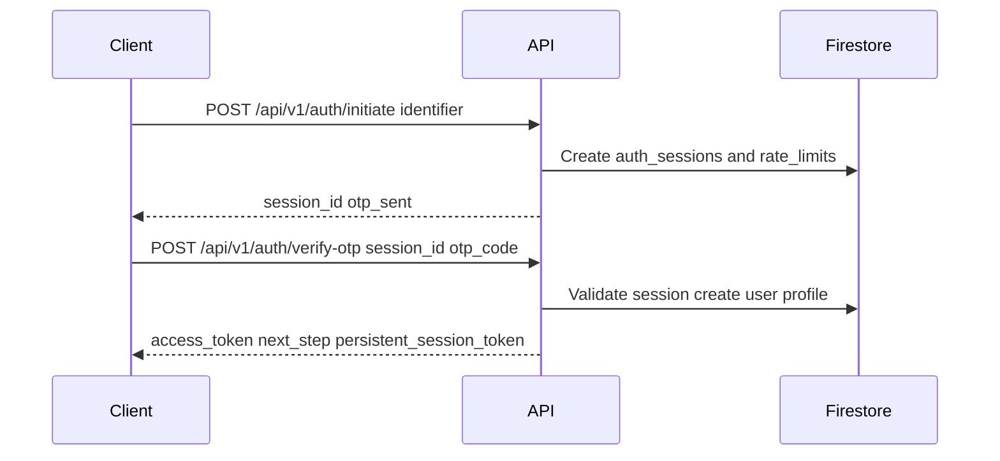
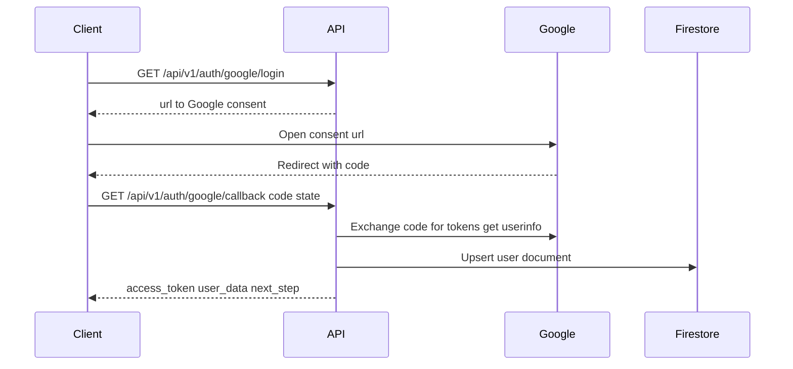

# ZODIRA Backend

A comprehensive FastAPI-based backend for the ZODIRA (Cosmic Predictions) astrology mobile app, providing Vedic astrology calculations, marriage compatibility analysis, personalized predictions, and complete user management.

## 🌟 Features

- **🔐 Advanced Authentication**: Phone, email/password, Google, and Facebook authentication
- **👤 User & Profile Management**: Multi-profile support with detailed birth information
- **💕 Vedic Marriage Matching**: 36 Guna compatibility system with dosha analysis
- **🔮 Personalized Predictions**: Daily, weekly, monthly astrology forecasts
- **👨‍⚕️ Astrologer Management**: Professional astrologer profiles and consultation booking
- **💰 Payment Integration**: Razorpay payment processing for consultations
- **🌐 Multilingual Support**: English and Hindi translations
- **📊 Comprehensive Analytics**: Firebase Analytics integration
- **🔒 Enterprise Security**: Firebase security rules and rate limiting
- **📱 API Documentation**: Complete OpenAPI/Swagger documentation

## 🛠️ Technology Stack

- **Framework**: FastAPI with async support
- **Database**: Firebase Firestore (NoSQL)
- **Authentication**: Firebase Auth (Phone, Email, OAuth)
- **Storage**: Firebase Cloud Storage
- **Payments**: Razorpay integration
- **Validation**: Pydantic v2 with comprehensive schemas
- **Internationalization**: Custom i18n system (English/Hindi)
- **Rate Limiting**: SlowAPI middleware
- **Monitoring**: Prometheus metrics
- **Testing**: pytest with async support
- **Containerization**: Docker ready
- **Deployment**: Google Cloud Run

## 📁 Project Structure

```
zodira_backend/
├── config/
│   ├── __init__.py
│   ├── config.py          # Environment & app configuration
│   └── firebase_config.py # Firebase Admin SDK setup
├── src/
│   ├── __init__.py
│   ├── schemas.py         # Comprehensive Pydantic models
│   ├── i18n.py           # Internationalization support
│   ├── firestore_schema.py # Database schema documentation
│   ├── astrology_engine.py # Vedic astrology calculations
│   ├── auth_utils.py     # Authentication utilities
│   ├── payments.py       # Razorpay payment processing
│   ├── middleware.py     # Custom middleware (metrics, etc.)
│   └── routers/
│       ├── __init__.py
│       ├── auth.py        # Multi-provider authentication
│       ├── users.py       # User & profile management
│       ├── marriage_matching.py # 36 Guna compatibility
│       ├── predictions.py # Astrology predictions
│       ├── astrologers.py # Astrologer management
│       ├── consultations.py # Consultation booking
│       ├── payments.py    # Payment processing
│       └── health.py      # Health checks & metrics
├── firebase-setup.sh     # Automated Firebase setup
├── firestore.rules       # Firestore security rules
├── storage.rules         # Storage security rules
├── FIREBASE_SETUP.md     # Detailed Firebase setup guide
├── Dockerfile           # Container configuration
├── main.py              # FastAPI application
├── requirements.txt     # Python dependencies
├── .env                 # Environment variables
├── tests/               # Comprehensive test suite
├── docs/                # API documentation
└── README.md
```

## 🚀 Installation & Setup

### 1. Prerequisites
- Python 3.8+
- Google Cloud SDK (`gcloud`)
- Git

### 2. Clone and Setup
```bash
git clone <repository-url>
cd zodira_backend

# Create virtual environment
python3 -m venv venv
source venv/bin/activate  # On Windows: venv\Scripts\activate

# Install dependencies
pip install -r requirements.txt
```

### 3. Firebase Project Setup
Choose one of the following methods:

#### Option A: Automated Setup (Recommended)
```bash
chmod +x firebase-setup.sh
./firebase-setup.sh
```

#### Option B: Manual Setup
Follow the detailed guide in [`FIREBASE_SETUP.md`](FIREBASE_SETUP.md)

### 4. Environment Configuration
Update `.env` file with your Firebase and payment credentials:
```env
# Firebase Configuration
FIREBASE_SERVICE_ACCOUNT_KEY_PATH=config/serviceAccountKey.json
FIREBASE_PROJECT_ID=your-project-id
FIREBASE_STORAGE_BUCKET=your-project-id.appspot.com

# Razorpay Configuration
RAZORPAY_KEY_ID=your_razorpay_key_id
RAZORPAY_KEY_SECRET=your_razorpay_key_secret
```

### 5. Deploy Security Rules
Upload `firestore.rules` and `storage.rules` to your Firebase Console:
- **Firestore**: Console → Firestore Database → Rules
- **Storage**: Console → Storage → Rules

## Running the Application

### Development
```bash
python main.py
```

The API will be available at `http://localhost:8000`

### With Uvicorn
```bash
uvicorn main:app --reload --host 0.0.0.0 --port 8000
```

### Local development (no Docker)

Follow these steps to run the backend natively on your machine without Docker:

1) Python environment
- macOS/Linux:
  - python3 -m venv venv
  - source venv/bin/activate
- Windows (PowerShell):
  - py -m venv venv
  - .\venv\Scripts\Activate.ps1

2) Install dependencies
- pip install -r requirements.txt

3) Configure environment
- cp .env.example .env
- Open .env and fill in required variables. Minimum to boot and hit Firestore:
  - FIREBASE_PROJECT_ID, FIREBASE_CLIENT_EMAIL, FIREBASE_PRIVATE_KEY_ID, FIREBASE_PRIVATE_KEY, FIREBASE_CLIENT_ID, FIREBASE_STORAGE_BUCKET
  - SECRET_KEY
- Optional (for full functionality):
  - SMTP (FIREBASE_SMTP_*): for email OTP delivery
  - MyDreams SMS (MYDREAMS_*): for SMS OTP delivery
  - GOOGLE_CLIENT_ID, GOOGLE_CLIENT_SECRET, REDIRECT_URI: for Google OAuth
  - OPENAI_API_KEY: for enhanced AI features

4) Run the server
- uvicorn app.main:app --reload --host 0.0.0.0 --port 8000

5) Verify
- Health: http://localhost:8000/api/v1/health
- Docs: http://localhost:8000/docs
- Auth:
  - POST /api/v1/auth/initiate
  - POST /api/v1/auth/verify-otp
  - GET /api/v1/auth/google/login
  - GET /api/v1/auth/google/callback (requires valid GOOGLE_CLIENT_ID/SECRET/REDIRECT_URI)

Notes:
- The Firebase Admin SDK is initialized from env in app/config/firebase.py; the private key requires literal \n escapes in .env which are converted at runtime.
- If SMTP/SMS aren’t set, OTP sessions still persist in Firestore, but real delivery won’t occur.
## API Documentation

Once running, visit `http://localhost:8000/docs` for interactive Swagger UI documentation.

### 📡 Key API Endpoints

#### 🔍 Health & Monitoring
- `GET /api/v1/health` - Service and database health check
- `GET /metrics` - Prometheus metrics

#### 🔐 Authentication
- `POST /api/v1/auth/register` - Email/password registration
- `POST /api/v1/auth/login` - Email/password login
- `POST /api/v1/auth/phone/send-verification` - Send phone OTP
- `POST /api/v1/auth/phone/verify` - Verify phone OTP
- `POST /api/v1/auth/oauth/login` - OAuth login (Google/Facebook)
- `POST /api/v1/auth/verify-token` - Token verification

#### 👤 User Management
- `POST /api/v1/users/{user_id}` - Create user profile
- `GET /api/v1/users/{user_id}` - Get user details
- `GET /api/v1/users/profiles` - List user profiles
- `POST /api/v1/users/profiles` - Create person profile
- `GET /api/v1/users/profiles/{profile_id}` - Get profile details
- `PUT /api/v1/users/profiles/{profile_id}` - Update profile
- `DELETE /api/v1/users/profiles/{profile_id}` - Delete profile

#### 💕 Marriage Compatibility
- `POST /api/v1/marriage-matching` - Calculate compatibility match
- `GET /api/v1/marriage-matching` - List user's matches
- `GET /api/v1/marriage-matching/{match_id}` - Get match details
- `DELETE /api/v1/marriage-matching/{match_id}` - Delete match

#### 🔮 Astrology Predictions
- `POST /api/v1/predictions/daily` - Generate daily prediction
- `POST /api/v1/predictions/weekly` - Generate weekly prediction
- `POST /api/v1/predictions/monthly` - Generate monthly prediction
- `GET /api/v1/predictions/history/{profile_id}` - Prediction history

#### 👨‍⚕️ Astrologer Management
- `GET /api/v1/astrologers` - List astrologers (with filtering)
- `GET /api/v1/astrologers/{astrologer_id}` - Get astrologer details
- `GET /api/v1/astrologers/availability/{astrologer_id}` - Check availability
- `POST /api/v1/astrologers/{astrologer_id}/reviews` - Add review

#### 📅 Consultations
- `POST /api/v1/consultations/book` - Book consultation
- `GET /api/v1/consultations` - List user's consultations
- `GET /api/v1/consultations/{consultation_id}` - Get consultation details
- `PUT /api/v1/consultations/{consultation_id}/cancel` - Cancel consultation
- `PUT /api/v1/consultations/{consultation_id}/complete` - Mark as completed
- `POST /api/v1/consultations/{consultation_id}/review` - Add consultation review

#### 💰 Payments
- `POST /api/v1/payments/create-order` - Create payment order
- `POST /api/v1/payments/verify` - Verify payment completion
- `GET /api/v1/payments/history` - Payment history
- `POST /api/v1/payments/refund/{payment_id}` - Request refund

## Testing

Run tests with pytest:
```bash
pytest
```

Run with coverage:
```bash
pytest --cov=src --cov-report=html
```

## Environment Variables

| Variable | Description | Required |
|----------|-------------|----------|
| `FIREBASE_SERVICE_ACCOUNT_KEY_PATH` | Path to Firebase service account JSON | Yes |
| `FIREBASE_PROJECT_ID` | Firebase project ID | Yes |
| `FIREBASE_STORAGE_BUCKET` | Firebase storage bucket | Yes |

## Deployment

### Docker (Planned)
```bash
docker build -t zodira-backend .
docker run -p 8000:8000 zodira-backend
```

### Production Considerations
- Set specific CORS origins instead of `*`
- Use environment-specific configuration
- Implement proper logging and monitoring
- Set up CI/CD pipelines
- Configure Firebase security rules

## Contributing

1. Fork the repository
2. Create a feature branch
3. Make changes with tests
4. Submit a pull request

## License

[Add license information]

## Deployment

### Production Setup

1. **Firebase Configuration**:
   - Set up your Firebase project
   - Download the service account key JSON file
   - Upload `firestore.rules` to your Firebase project
   - Enable Authentication and Firestore

2. **Environment Variables**:
   Set the following on your production server:
   ```
   FIREBASE_SERVICE_ACCOUNT_KEY_PATH=/path/to/serviceAccountKey.json
   FIREBASE_PROJECT_ID=your-project-id
   FIREBASE_STORAGE_BUCKET=your-project-id.appspot.com
   ```

3. **Docker Deployment**:
   ```bash
   docker build -t zodira-backend .
   docker run -d -p 8000:8000 --env-file .env zodira-backend
   ```

4. **Monitoring**:
   - Metrics available at `/metrics` for Prometheus
   - Health check at `/api/v1/health`

Note: Firebase handles database and authentication, so no additional services needed in docker-compose.

## Security

- Rate limiting implemented with slowapi
- Firebase Security Rules enforce data access control
- All endpoints require authentication except health and auth routes

## Support

For questions or issues, please [add contact information]
# Backend API Specification and Implementation Guide

Audience: Flutter developers integrating the ZODIRA backend  
Base URL (local): http://localhost:8000
Production API Base URL: https://zodirabackend-506518268983.asia-east1.run.app
API Version: v1  
Auth: Bearer JWT from /api/v1/auth, persistent session supported  
Data store: Firestore  
Sessions and rate limiting: Firestore-based (no Redis)

References to code:
- App wiring [FastAPI()](app/main.py:35), routers include health, auth, users, astrology, enhanced.
- Auth router [router](app/api/v1/unified_auth.py) exposes initiate, verify-otp, google-oauth, google login and callback, logout, health.
- Unified auth service [UserService](app/services/user_service.py:57) implements OTP flows, Google OAuth, persistent sessions.
- JWT creation [create_access_token()](app/core/security.py:65), verification [verify_token()](app/core/security.py:92).
- Auth dependency [get_current_user()](app/core/dependencies.py:10).
- Health endpoint [health_check()](app/api/v1/health.py:11).
- Enhanced astrology endpoints [router](app/api/v1/enhanced_astrology.py).
- Astrology classic endpoints [router](app/api/v1/astrology.py).

## 1. Authentication Overview

Auth mechanisms supported:
- Email or Phone OTP login initiated via /api/v1/auth/initiate and completed via /api/v1/auth/verify-otp.
- Google OAuth:
  - GET /api/v1/auth/google/login returns the Google consent URL
  - The OAuth redirect URI must be set to /api/v1/auth/google/callback
- Persistent session for auto-login across app starts is supported via enhanced endpoints:
  - POST /api/v1/enhanced/auth/persistent-login
  - POST /api/v1/enhanced/auth/logout and GET /api/v1/enhanced/auth/sessions

JWTs are short-lived access tokens created by [create_access_token()](app/core/security.py:65) and verified by [verify_token()](app/core/security.py:92). The current design does not include refresh tokens; instead, a Firestore-backed persistent session is used for auto-login.

Required request header for protected endpoints:
- Authorization: Bearer {access_token}

### 1.1 Rate limiting
- Firestore fixed-window rate limiting is applied to OTP initiation [UserService._check_rate_limit()](app/services/user_service.py:142)
- Global SlowAPI middleware is enabled in [app.main](app/main.py:44). Per-route decorators are not currently configured.

### 1.2 Error format
- Error responses are standard FastAPI HTTPException JSON: { "detail": "message" }
- Common status codes: 400 validation, 401 unauthorized, 403 forbidden, 404 not found, 500 server error

## 2. Authentication API

Router: /api/v1/auth from [router](app/api/v1/unified_auth.py)

### 2.1 Initiate OTP
POST /api/v1/auth/initiate  
Body:
{
  "identifier": "user@example.com"
}

- identifier can be email or E.164 phone number.
- On success, creates Firestore auth session and attempts delivery via email or SMS.

Response 200:
{
  "session_id": "string",
  "auth_type": "email or phone",
  "status": "otp_sent",
  "message": "OTP sent to your email address",
  "expires_in": 300,
  "next_step": "verify_otp"
}

Implementation [initiate_authentication()](app/api/v1/unified_auth.py:112) -> [UserService.initiate_auth()](app/services/user_service.py:83)

Notes:
- SMS integration uses MyDreams API. Email uses SMTP credentials. Delivery can be disabled in dev while sessions still persist.

### 2.2 Verify OTP
POST /api/v1/auth/verify-otp  
Body:
{
  "session_id": "string",
  "otp_code": "123456"
}

Response 200:
{
  "session_id": "string",
  "access_token": "jwt",
  "user_id": "uid",
  "status": "authenticated",
  "is_new_user": false,
  "next_step": "dashboard or complete_profile",
  "user_data": {
    "uid": "uid",
    "email": "user@example.com",
    "phone": null,
    "display_name": null,
    "profile_complete": false
  }
}

Implementation [verify_otp()](app/api/v1/unified_auth.py:130) -> [UserService.verify_otp()](app/services/user_service.py:344)

Server behavior:
- Validates session and OTP, creates user in Firebase Auth if needed, ensures a Firestore 'users' document exists, generates JWT [create_access_token()](app/core/security.py:65), creates a persistent session token [create_persistent_session()](app/services/user_service.py:769), and computes next_step based on profiles [UserService._determine_next_step()](app/services/user_service.py:525)

### 2.3 Google OAuth
GET /api/v1/auth/google/login  
- Returns a JSON with a URL for Google consent.

Response 200:
{
  "url": "https://accounts.google.com/o/oauth2/v2/auth?...state..."
}

Implementation [google_login()](app/api/v1/unified_auth.py:158)

GET /api/v1/auth/google/callback?code=...&state=...
- Exchanges code for tokens and fetches userinfo; logs the user in, creates Firestore profile data if needed.

Response 200:
{
  "access_token": "jwt",
  "user": { ...user_data... },
  "is_new_user": false,
  "next_step": "dashboard"
}

Implementation [google_callback()](app/api/v1/unified_auth.py:171) -> [UserService.handle_google_user()](app/services/user_service.py:622)

### 2.4 Logout
POST /api/v1/auth/logout  
Headers:
- Authorization: Bearer {access_token}

Body:
{
  "session_id": "optional-current-session-id"
}

Response 200:
{
  "message": "Logged out successfully"
}

Implementation [logout()](app/api/v1/unified_auth.py:211) -> [UserService.logout()](app/services/user_service.py:706)

Note:
- If using persistent sessions, use /api/v1/enhanced/auth/logout with session_token to invalidate that session (see section 4).

### 2.5 Auth health
GET /api/v1/auth/health  
Response 200:
{
  "status": "healthy",
  "firebase": "connected"
}

Implementation [auth_health_check()](app/api/v1/unified_auth.py:222)

## 3. User and Profile APIs

Router: /api/v1/users from [router](app/api/v1/user_management.py)

Headers for all endpoints: Authorization: Bearer {access_token}

### 3.1 Get profiles
GET /api/v1/users/profiles  
Response 200:
[
  {
    "id": "profile_id",
    "userId": "uid",
    "name": "John Doe",
    "birth_date": "1990-01-01",
    "birth_time": "08:59:00",
    "birth_place": "City, Country",
    "gender": "male",
    "zodiac_sign": "Aries",
    "nakshatra": "Rohini",
    "moon_sign": "Taurus",
    "createdAt": "timestamp",
    "updated_at": "timestamp"
  }
]

Implementation [get_profiles()](app/api/v1/user_management.py:504)

### 3.2 Create profile
POST /api/v1/users/profiles  
Body:
{
  "user_id": "optional, server uses token if provided mismatch",
  "name": "John Doe",
  "birthDate": "1990-01-01",
  "birthTime": "08:59:00",
  "birthPlace": "City, Country",
  "gender": "male",
  "created_at": "2024-01-01T12:00:00Z"
}

Response 200: ProfileResponse (same fields as GET)  
Implementation [create_profile()](app/api/v1/user_management.py:631)

Notes:
- The server uses the authenticated userId from the token. If user_id in body mismatches token, token wins.

### 3.3 Get profile
GET /api/v1/users/profiles/{profile_id}  
Response 200: ProfileResponse  
Implementation [get_profile_or_status()](app/api/v1/user_management.py:735)

### 3.4 Update profile
PUT /api/v1/users/profiles/{profile_id}  
Body: PersonProfile model fields  
Response 200: ProfileResponse  
Implementation [update_profile()](app/api/v1/user_management.py:784)

### 3.5 Delete profile
DELETE /api/v1/users/profiles/{profile_id}  
Response 200:
{
  "message": "Profile deleted successfully"
}

Implementation [delete_profile()](app/api/v1/user_management.py:836)

### 3.6 User details and dashboard
- GET /api/v1/users/user-details returns a comprehensive user payload with profiles and predictions [get_user_details()](app/api/v1/user_management.py:274)
- GET /api/v1/users/dashboard returns summary data for dashboards [get_user_dashboard()](app/api/v1/user_management.py:521)

## 4. Enhanced Astrology and Persistent Auth APIs

Router: /api/v1/enhanced from [router](app/api/v1/enhanced_astrology.py)

Headers: Authorization: Bearer {access_token}

### 4.1 Persistent authentication
- POST /api/v1/enhanced/auth/persistent-login
  - Header: Authorization: Bearer {persistent_session_token}
  - Returns new access_token and next_step
  - Implementation [persistent_login()](app/api/v1/enhanced_astrology.py:33) -> [UserService.check_persistent_login()](app/services/user_service.py:1021)

- POST /api/v1/enhanced/auth/logout?session_token=...
  - Invalidates the persistent session for the current user
  - Implementation [logout()](app/api/v1/enhanced_astrology.py:68) -> [UserService.invalidate_persistent_session()](app/services/user_service.py:917)

- GET /api/v1/enhanced/auth/sessions
  - Lists active sessions for the current user
  - Implementation [get_user_sessions()](app/api/v1/enhanced_astrology.py:91) -> [UserService.get_user_sessions()](app/services/user_service.py:984)

### 4.2 Enhanced profile and predictions
- POST /api/v1/enhanced/profiles/{profile_id}/generate-chart
  - Generates chart and predictions for a profile
  - Implementation [generate_profile_chart()](app/api/v1/enhanced_astrology.py:128)

- GET /api/v1/enhanced/profiles/{profile_id}/complete
  - Full profile with chart, predictions, matches
  - Implementation [get_complete_profile()](app/api/v1/enhanced_astrology.py:175)

- GET /api/v1/enhanced/profiles/{profile_id}/predictions?prediction_type=daily|weekly|monthly|yearly|career|health|relationship|finance
  - Filterable predictions
  - Implementation [get_profile_predictions()](app/api/v1/enhanced_astrology.py:204)

- POST /api/v1/enhanced/profiles/{profile_id}/predictions/{prediction_type}
  - Generates a specific prediction on demand
  - Implementation [generate_specific_prediction()](app/api/v1/enhanced_astrology.py:245)

- POST /api/v1/enhanced/profiles/{profile_id}/refresh-predictions
  - Batch regenerate predictions
  - Implementation [refresh_profile_predictions()](app/api/v1/enhanced_astrology.py:526)

### 4.3 Marriage matching
- POST /api/v1/enhanced/marriage-matching/generate
  - Body includes partner_data with name, birth_date, birth_time, birth_place, gender
  - Implementation [generate_marriage_match()](app/api/v1/enhanced_astrology.py:316)

- GET /api/v1/enhanced/marriage-matching/{match_id}
  - Returns match and partner profile
  - Implementation [get_marriage_match()](app/api/v1/enhanced_astrology.py:366)

- GET /api/v1/enhanced/profiles/{profile_id}/marriage-matches
  - Lists matches for a profile
  - Implementation [get_profile_marriage_matches()](app/api/v1/enhanced_astrology.py:417)

### 4.4 Dashboard
- GET /api/v1/enhanced/dashboard
  - Consolidated view of profiles, predictions, matches
  - Implementation [get_dashboard_data()](app/api/v1/enhanced_astrology.py:451)

## 5. Astrology APIs (Classic)

Router: /api/v1/astrology from [router](app/api/v1/astrology.py)

- POST /api/v1/astrology/generate-chart
  - Body: { "profile_id": "uuid" }
  - Starts background chart generation if not already present
  - Implementation [generate_astrology_chart()](app/api/v1/astrology.py:106)

- GET /api/v1/astrology/chart/{profile_id}
  - Returns AstrologyChartResponse if available
  - Implementation [get_astrology_chart()](app/api/v1/astrology.py:180)

- GET /api/v1/astrology/chart/{profile_id}/status
  - completed or not_found
  - Implementation [get_chart_generation_status()](app/api/v1/astrology.py:236)

- DELETE /api/v1/astrology/chart/{profile_id}
  - Deletes the stored chart
  - Implementation [delete_astrology_chart()](app/api/v1/astrology.py:281)

## 6. Health and Observability

- GET /api/v1/health
  - Database ping and app version
  - Implementation [health_check()](app/api/v1/health.py:11)

- GET /metrics
  - Prometheus text metrics
  - Implementation [metrics handler](app/main.py:83)

## 7. JWT and Security

JWT Claims:
- sub: user id
- email or phone depending on auth
- auth_type: email, phone, google, or persistent_session
- iat, exp, jti, iss

Create and verify:
- [create_access_token()](app/core/security.py:65)
- [verify_token()](app/core/security.py:92)

Auth dependency:
- [get_current_user()](app/core/dependencies.py:10) extracts user_id from JWT sub and raises 401 on invalid token.

Logout semantics:
- API token invalidation is logical; consider using token blacklist [blacklist_token()](app/core/security.py:126) for hard logout flows if needed.

## 8. Firestore Collections

Key collections with typical documents:

- users
  - id: user_id
  - fields: email, phone, displayName, createdAt, lastLoginAt, profile_complete, subscriptionType, google_id optional
- person_profiles
  - id: profile_id
  - fields: user_id, name, birth_date, birth_time, birth_place, gender, astrology fields, created_at, updated_at, is_active
- auth_sessions (ephemeral)
  - id: session_id
  - fields: identifier, auth_type, otp_code, expires_at ISO, attempts, max_attempts, status
- rate_limits
  - id: auth_rate_limit:hash
  - fields: attempts, window_started_at
- user_sessions (persistent login)
  - id: session_token
  - fields: user_id, created_at, last_accessed, expires_at, is_active, device_info
- predictions
  - id: profileId_type_timestamp
  - fields: profile_id, user_id, prediction_type, prediction_text, created_at, expires_at, is_active
- marriage_matches
  - id: uuid
  - fields: user_id, main_profile_id, partner_profile_id, overall_score, guna_score, strengths, challenges, created_at, is_active
- astrology_charts
  - id: userId_profileId
  - fields: houses, vimshottari_dasha, birth_details, created_at, updated_at

## 9. Request Examples

Headers for protected endpoints:
Authorization: Bearer {access_token}

Auth initiate
curl -X POST http://localhost:8000/api/v1/auth/initiate \
  -H "Content-Type: application/json" \
  -d '{"identifier":"user@example.com"}'

Verify OTP
curl -X POST http://localhost:8000/api/v1/auth/verify-otp \
  -H "Content-Type: application/json" \
  -d '{"session_id":"SESSION","otp_code":"123456"}'

Google login URL
curl http://localhost:8000/api/v1/auth/google/login

Create profile
curl -X POST http://localhost:8000/api/v1/users/profiles \
  -H "Authorization: Bearer ACCESS" \
  -H "Content-Type: application/json" \
  -d '{"name":"John Doe","birthDate":"1990-01-01","birthTime":"08:59:00","birthPlace":"City, Country","gender":"male","created_at":"2024-01-01T12:00:00Z"}'

Get complete profile
curl http://localhost:8000/api/v1/enhanced/profiles/PROFILE_ID/complete \
  -H "Authorization: Bearer ACCESS"

Generate daily prediction
curl -X POST http://localhost:8000/api/v1/enhanced/profiles/PROFILE_ID/predictions/daily \
  -H "Authorization: Bearer ACCESS"

### Error responses
- 401 Unauthorized:
  {
    "detail": "Invalid or expired token"
  }
- 403 Forbidden:
  {
    "detail": "Access denied"
  }
- 404 Not Found:
  {
    "detail": "Profile not found"
  }

## 10. Flutter Integration Notes

Headers and tokens:
- Store the access_token securely (Flutter secure storage).
- For auto-login, store the persistent_session_token returned by verify-otp response in the field persistent_session_token if used; then call POST /api/v1/enhanced/auth/persistent-login with Authorization: Bearer {persistent_session_token} on app start to retrieve a fresh access_token and next_step.

Next step handling:
- Next step can be complete_profile or dashboard. Route users accordingly:
  - complete_profile: navigate to profile creation view
  - dashboard: show main app dashboard using /api/v1/enhanced/dashboard

Phone numbers:
- Use E.164 format for identifiers when initiating phone OTP.
- The backend normalizes some formats for Indian numbers; always prefer E.164.

Timeouts and retries:
- For OTP delivery, the API returns 200 even when SMTP or SMS provider fails, relying on logs; the client should show a standard message and allow resending by calling /api/v1/auth/initiate again.

Pagination:
- List endpoints currently return limited documents without pagination metadata. If datasets grow large, pagination parameters will be added.

CORS and environments:
- In production, set ALLOWED_ORIGINS to your Flutter app web origin if using web builds. See [settings](app/config/settings.py:25).

## 11. Sequence Diagrams

OTP Login (Email or Phone)


Google OAuth Flow


## 12. Non-Docker Local Development

Follow the steps in the Local development section of this README. Key points:
- Ensure Firebase env vars are set; private key uses literal \\n which the code converts in [initialize_firebase()](app/config/firebase.py:16)
- Run with:
  uvicorn app.main:app --reload --host 0.0.0.0 --port 8000

## 13. Production Notes

- Restrict CORS in [settings](app/config/settings.py:25)
- Rotate and secure secrets
- Consider Firestore TTL for auth_sessions and user_sessions
- Add per-route SlowAPI decorators if you want stricter API wide limits

## 14. Backward Compatibility and Deprecations

- Old auth endpoints under /api/v1/users such as initiate and verify-otp are deprecated and return HTTP 410 Gone in [user_management router](app/api/v1/user_management.py:215)
- Use the unified auth endpoints under /api/v1/auth instead.
